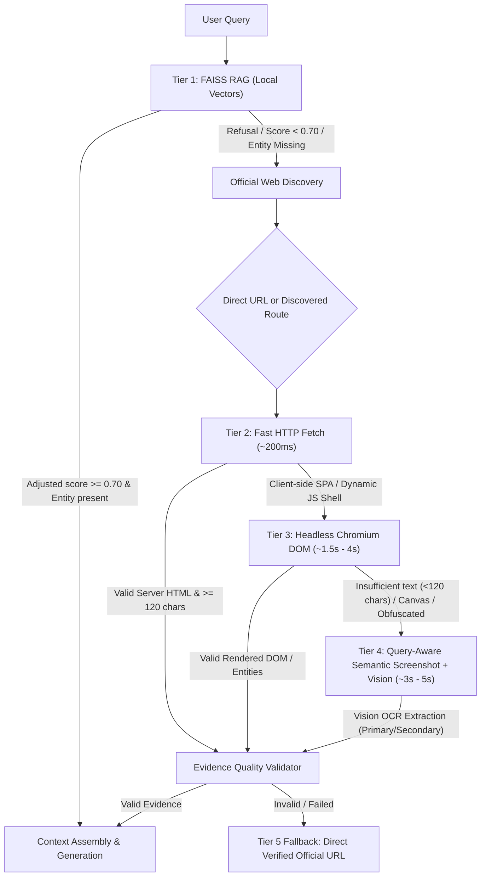
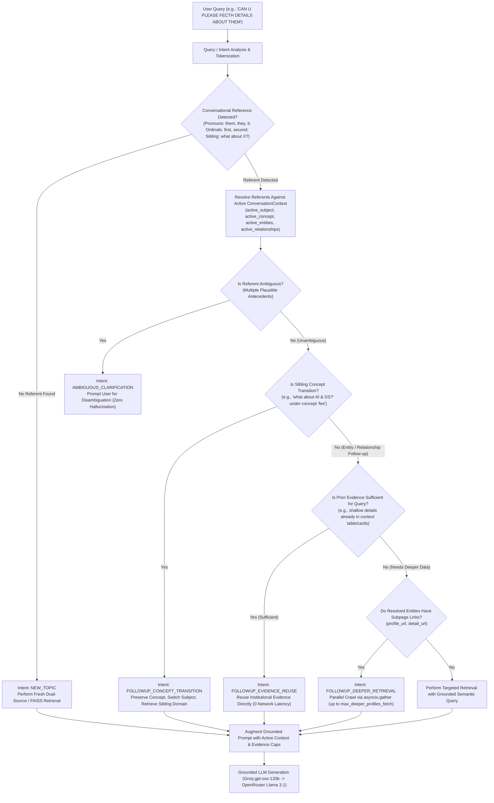

# VAIT Institutional Knowledge Architecture & Multi-Tier Retrieval Pipeline
*The Authoritative Architecture & Engineering Specification for VAIT (Vasireddy Venkatadri AI Assistant)*

---

## 1. Executive Summary & Dual-Period Architecture

VAIT is designed with institutional grounding for **Vasireddy Venkatadri Institute of Technology (VVIT)** and its evolution into **VVIT University (VVITU)**.

### Dual Institutional Periods
1. **Current (2024–Present):** **VVIT University (VVITU)**
   - Official domain: `vvitu.ac.in` (and `www.vvitu.ac.in`)
   - Technology stack: Modern client-side React SPA, dynamic client-side routing, asynchronous API hydration.
2. **Historical (2007–2024):** **Vasireddy Venkatadri Institute of Technology (VVIT)**
   - Official legacy domain: `vvitguntur.com` (and `www.vvitguntur.com`)
   - Technology stack: Server-rendered CMS (Joomla), static archives, legacy syllabi, historical leadership.

---

## 2. Four-Tier Retrieval Pipeline

VAIT organizes retrieval into four distinct, prioritized tiers to maximize speed, accuracy, and fallback resilience while strictly preventing hallucinations.



### Tier Specifications

| Tier | Subsystem | Latency | Technology | Scope & Purpose |
|---|---|---|---|---|
| **Tier 1** | Local Vector RAG | 0ms – 150ms | FAISS index, local embeddings | Core institutional handbook, static rules, admissions criteria |
| **Tier 2** | Fast HTTP Fetch | 150ms – 400ms | `requests` / `httpx`, BeautifulSoup | Static server-rendered pages, legacy archives, Joomla endpoints |
| **Tier 3** | Headless Browser DOM | 1.5s – 4.0s | Playwright Chromium, SPA hydration | React SPA rendered DOM, card grids, HTML tables |
| **Tier 4** | Query-Aware Screenshot + Vision | 3.0s – 5.0s | Playwright semantic tiling + Multimodal LLM OCR | Canvas rendering, visually-nested cards, image banners |
| **Fallback** | Direct Canonical URL | 0ms | Curated official route mapping | Direct clickable link provided when automatic extraction fails |

---

## 3. Query-Aware Semantic Screenshot & Vision Subsystem (Tier 4)

### Bounded Element Targeting & Semantic Tiling
- **The Problem:** The root container `#root` on modern SPAs can span upwards of 10,000 pixels. Capturing full-page screenshots squashes typography, exceeding multimodal vision token limits and rendering text illegible.
- **The Solution:**
  1. **Generic Query-Aware Scoring:** Analyzes DOM candidate containers (`main`, `article`, `[class*='grid']`, `table`, `.container`) and scores them using query terms, semantic tags (`h1`-`h4`), and structured class keywords.
  2. **Bounded Element Screenshot:** If target element height $\le 1600	ext{px}$, captures a single high-resolution PNG.
  3. **Semantic Tiling:** If target element height $> 1600	ext{px}$, partitions child elements (`cards`, `sections`, `rows`) into up to 4 bounded tiles.
  4. **Multi-Tile Extraction & Deduplication:** Runs multimodal vision over individual tiles and merges/deduplicates extracted facts.

### Dual-Model Vision Fallback
1. **Primary Model:** `google/gemini-2.5-flash` via OpenRouter (low latency, high OCR visual accuracy).
2. **Secondary Model:** `meta-llama/llama-3.2-11b-vision-instruct` via OpenRouter (robust secondary fallback).
3. **Extraction Prompt Guard:** Instructs the vision model to extract only explicitly visible facts and output strict negative notice if information is absent, preventing visual hallucination.

### Memory & Cache Safety
- Raw Base64 screenshot strings are discarded immediately following text extraction.
- The returned `BrowserRenderResult` and `OfficialWebResult` store `screenshot_b64 = None` to ensure zero memory bloat in memory caches.

---

## 4. Security & Guardrails (SSRF & Concurrency)

### SSRF Protection Model
- **Strict Domain Allowlist:** Only `vvitu.ac.in`, `www.vvitu.ac.in`, `vvitguntur.com`, and `www.vvitguntur.com` are permitted.
- **Private IP & Loopback Filter:** Immediate rejection of `127.0.0.0/8`, `10.0.0.0/8`, `172.16.0.0/12`, `192.168.0.0/16`, `169.254.0.0/16`, `0.0.0.0`, and IPv6 equivalents.
- **Playwright Route Interception:** Client-side JavaScript redirects and navigation events are intercepted via `page.route("**/*")`. Any navigation targeting off-domain hosts is aborted (`blockedbyclient`).

### Concurrency Architecture
- **Initialization Lock (`_init_lock`):** Serializes Playwright browser launching and teardown.
- **Request Semaphore (`_semaphore`):** Governs concurrent page operations via `asyncio.Semaphore(max_concurrent_browser_pages)` (default: 3).

---

## 5. Caching & Evidence Validation

### Content-Aware Cache TTL
- **Static Institutional Records:** 7,200 seconds (2 hours) for official catalogs, leadership rosters, legacy archives.
- **Dynamic Content:** 600 seconds (10 minutes) for live headless browser renders, examination circulars, notifications.

### Evidence Quality Validation
- Implemented via `EvidenceQualityValidator`:
  - Classifies query intent: `faculty`, `exam`, `fee`, `course`, `notice`, `admission`, `general`.
  - Verifies factual density: requires structured entities or domain keywords and minimum text lengths.
  - Rejects extraction failure placeholders and navigation headers.

---

## 6. Cloud Deployment Topology

- **Containerization:** Production Docker image based on `python:3.11-slim-bullseye`.
- **System Dependencies:** Includes all required X11, Cairo, Pango, and NSS shared libraries for headless Chromium execution.
- **Non-Root Execution:** Runs under dedicated `appuser` (UID 1000).
- **Configuration Management:** Environment variables configured in `render.yaml` and loaded via Pydantic `Settings`.

---

## 7. Generic Institutional Conversational Context & Reference Resolution

VAIT implements a generic institutional conversational context and entity resolution engine (`ConversationContextResolver`). Rather than implementing domain-specific or entity-specific shortcuts, the engine operates on a generalized institutional ontology where entities, concepts, subjects, attributes, and relationships are first-class constructs.

### Core Architectural Principle
> **"Understand what the query refers to before deciding what retrieval to perform."**



### Generic Institutional Ontology & Data Model
The context engine defines generic data representations that scale uniformly across all university domains (Faculty, Fees, Departments, Courses, Hostels, Transport, Examinations, Circulars/Notices, Placements, Facilities, Leadership, etc.):

1. **`InstitutionalEntity`**:
   - `name`: Entity identifier or label (e.g., `"Dr. K. Suresh"`, `"Boys Hostel Block A"`, `"B.Tech CSE"`).
   - `entity_type`: Category classification (e.g., `"faculty"`, `"facility"`, `"course"`, `"department"`, `"hostel"`).
   - `subject`: Domain subject (e.g., `"Computer Science & Engineering"`, `"Transport"`).
   - `concept`: Institutional concept (e.g., `"faculty"`, `"fee"`, `"examination"`, `"notice"`).
   - `attributes`: Flexible dictionary of key-value attributes (e.g., `{"designation": "Professor & HOD", "qualifications": "Ph.D", "annual_fee": "70,000 INR"}`).
   - `relationships`: Directed relational mappings (e.g., `{"hod_of": "CSE", "reports_to": "Principal"}`).
   - `source_urls`: List of provenance URLs from official domains.
   - `confidence`: Extraction confidence score (0.0 to 1.0).

2. **`ConversationContext`**:
   - `active_subject`: Current academic or operational subject (e.g., `"CSE (AI & DS)"`, `"Mechanical Engineering"`).
   - `active_concept`: Current university concept (e.g., `"faculty"`, `"fee"`, `"syllabus"`, `"placement"`).
   - `active_entities`: Chronological list of `InstitutionalEntity` instances extracted from previous turns.
   - `active_relationships`: Contextual relationships between active entities.
   - `active_filters`: Active temporal or categorical filters (e.g., `academic_year="2025-26"`, `branch="CSE"`).
   - `last_evidence_text`: Cached raw evidence from the preceding institutional retrieval.
   - `recent_referents`: FIFO queue of recent salient referents for recency-biased pronoun binding.
   - `turn_count`: Total conversation turn counter.

### Linguistic Reference Resolution Engine
- **Plural Pronouns & Demonstratives** (*them, they, their, these, those, all of them*):
  - Resolves to all currently active entities within the matching concept or subject scope.
- **Singular Pronouns** (*he, she, his, her, it, this, that*):
  - Resolves to the most recently referenced singular entity matching gender/entity-type constraints (e.g., person vs. non-person).
  - Distinguishes non-person singular pronoun `"it"` (*"when was it published?"*) from department abbreviation `"IT"` (*"Information Technology"*).
- **Ordinal References** (*first, second, third, last, the former, the latter*):
  - Position-based mapping directly into `active_entities` (1-indexed or relative offset).
- **Relationship Traversal** (*"who is the hod?", "who is the director?", "who is the warden?"*):
  - Traverses institutional relationship hierarchies grounded in official leadership directories.
- **Sibling Concept Transitions** (*"what about AI & DS?", "how about ECE?"*):
  - Detects subject transitions while maintaining the `active_concept` (e.g., maintaining `fee` or `syllabus` inquiry across branches without query amnesia).
- **Ambiguity Detection**:
  - Detects when multiple disparate candidate entity sets exist (e.g., multiple branches or facilities mentioned previously) and generates an explicit clarification response (`AMBIGUOUS_CLARIFICATION`) rather than hallucinating an arbitrary target.

### Evidence Reuse vs. Deeper Retrieval
1. **Evidence Reuse (`FOLLOWUP_EVIDENCE_REUSE`)**:
   - When a follow-up asks for details already present in the cached evidence (e.g. designation, qualification, room fees, contact emails present in dynamic web tables or cards), VAIT bypasses the network completely, achieving **zero network latency** while maintaining 100% factual fidelity.
2. **Parallel Deeper Crawl (`FOLLOWUP_DEEPER_RETRIEVAL`)**:
   - When a follow-up queries deep attributes not in the summary (e.g., specific publications, patents, detailed syllabus PDF links), the engine extracts `profile_url` or `detail_url` links and concurrently fetches up to `max_deeper_profiles_fetch` (default: 3) subpages using `asyncio.gather(*tasks, return_exceptions=True)`.
3. **Evidence Context Capping & TPM Protection**:
   - Large directories (e.g., 156 CSE faculty records exceeding 27,000 characters) could exceed downstream LLM tokens-per-minute (TPM) limits on providers like Groq. Evidence context injected into generation prompts is capped at `max_evidence_chars = 9500` with previous context summaries capped at `1200` characters, ensuring total prompt tokens remain below 2,000 tokens while preserving full semantic fidelity.

### State Hydration & Streaming Parity
- Context states are persisted to MongoDB under the conversation document.
- `_get_or_rehydrate_context` dynamically reconstructs `ConversationContext` from stored state or by parsing historical conversation turns.
- Both `/api/vait/chat` and `/api/vait/chat/stream` utilize identical reference resolution pipelines, ensuring 100% behavioral parity regardless of streaming mode.

---

## 8. Indian Standard Time (IST / Asia/Kolkata) Grounding

VAIT enforces Indian Standard Time (`Asia/Kolkata`, UTC+05:30) project-wide to ensure temporal accuracy for academic schedules, circulars, admission deadlines, and date calculations.

### Backend Timezone Enforcement
- **Central Configuration:** `app_timezone: str = "Asia/Kolkata"` defined in `Settings` with automatic fallback via the `tzdata` package.
- **Grounding Helper:** `app.utils.timezone` provides `now_ist()`, `to_ist()`, `format_ist()`, `resolve_relative_date()`, and `get_ist_grounding_context()`.
- **System Prompt Injection:** Injects current IST date, day of week, time, and academic year into LLM prompts (`_build_generation_prompt` and `_build_llm_only_prompt`):
  ```
  CURRENT SYSTEM TIMEZONE & DATE (Asia/Kolkata / IST, UTC+05:30):
  - Current Date & Time: Saturday, 12 September 2026, 10:30 AM IST
  - Current Day: Saturday
  - Indian Standard Time (IST) offset: +05:30
  - All relative date inquiries ('today', 'yesterday', 'tomorrow', 'this week', 'current academic year') MUST be interpreted strictly according to this IST reference date.
  ```

### Frontend Timezone Formatting
- All user-facing timestamps in `MessageBubble.jsx` and `HistoryList.jsx` explicitly use `timeZone: 'Asia/Kolkata'` in `toLocaleTimeString` and `toLocaleDateString`, guaranteeing visual consistency regardless of the user's browser locale.

